# RAG Pipeline Experiment 

A framework for systematically experimenting, evaluating, and improving **RAG (Retrieval-Augmented Generation)** pipeline performance on a Korean Q&A dataset. It supports an **iterative improvement cycle** that automatically identifies incorrect answers and re-generates/re-evaluates them with improved strategies.

## 📋 Table of Contents

- [Key Features](#-key-features)
- [Overall Architecture](#-overall-architecture)
- [Experiment Workflow](#-experiment-workflow)
- [Project Structure](#-project-structure)
- [Module Details](#-module-details)
  - [Stage 1: RAG Answer Generation](#1%EF%B8%8F⃣-1_rag_generation---rag-answer-generation)
  - [Stage 2: Evaluation](#2%EF%B8%8F⃣-2_evaluation---ragas--llm-evaluation)
  - [Stage 3: Result Merging](#3%EF%B8%8F⃣-3_re_evaluation---result-merging)
  - [Stage 4: Index Correction](#4%EF%B8%8F⃣-4_update_incorrect_indices---index-correction)
- [Chunking Strategies](#-chunking-strategies)
- [Retrieval Strategies](#-retrieval-strategies)
- [Models Used](#-models-used)
- [How to Run](#-how-to-run)
- [Configuration Examples](#-configuration-examples)
- [Runtime Environment](#-runtime-environment)
- [Experiment Results](#-experiment-results)

---

## ✨ Key Features

| Feature | Description |
|---------|-------------|
| **Multiple Chunking Strategies** | Simple Chunking and Parent-Child Chunking |
| **Hybrid Retrieval** | Vector (ChromaDB) + BM25 (Kiwi morphological analysis) + RRF fusion |
| **Reranking** | Context reranking with BGE-reranker-v2-m3 |
| **RAGAS Evaluation** | Faithfulness, Answer Relevancy, Context Precision/Recall |
| **LLM Accuracy Evaluation** | Semantic correctness judgment via GPT |
| **Iterative Improvement** | Auto-identify incorrect answers → re-experiment with improved strategy |
| **Checkpointing** | Resume evaluation from where it stopped |
| **Filtered Execution** | Selectively re-generate/re-evaluate only incorrect items |

---

## 🏗 Overall Architecture


---

## 🔄 Experiment Workflow

The diagram below shows the overall flow of the iterative improvement cycle.

```mermaid
flowchart LR
    A["🔨 1. Baseline<br/>RAG Answer Generation<br/>(All Items)"] --> B["📊 2. RAGAS +<br/>Accuracy Evaluation"]
    B --> C{"Accuracy<br/>Target Met?"}
    C -->|"✅ Yes"| D["🎉 Experiment Complete"]
    C -->|"❌ No"| E["📋 3. Identify Incorrect<br/>(incorrect_indices.json)"]
    E --> F["⚙️ 4. Change Strategy<br/>Parent-Child / Hybrid"]
    F --> G["🔨 5. Re-generate<br/>Incorrect Only"]
    G --> H["📊 6. Re-evaluate<br/>(Subset)"]
    H --> I["🔀 7. Merge Results<br/>(Baseline + Subset)"]
    I --> J["🔧 8. Index Correction"]
    J --> C
```



### Experiment Progress History


---

## 📁 Project Structure

```
Exp_2/
├── README.md                          # This file
├── incorrect_indices.json             # Incorrect item indices (shared file)
│
├── 1_rag_generation/                  # RAG answer generation
│   ├── config.py                      # Experiment config (chunking, retrieval, model paths)
│   ├── run.py                         # Full pipeline execution (steps 1→2→3)
│   ├── build_pdf_chroma.py            # Vector DB construction
│   ├── build_bm25_index.py            # BM25 index construction
│   ├── rag_answer_pipeline.py         # RAG answer generation
│   ├── chunking_strategies.py         # Chunking strategy classes (Strategy Pattern)
│   ├── bm25_index.py                  # BM25 index utilities
│   ├── utils.py                       # Common utilities
│   └── output/                        # Generated answers storage
│       ├── parent_child/
│       └── parent_child_hybrid/
│
├── 2_evaluation/                      # RAGAS + accuracy evaluation
│   ├── config.py                      # Evaluation config
│   ├── run.py                         # Full evaluation pipeline
│   ├── ragas_eval.py                  # RAGAS metric evaluation (with checkpointing)
│   ├── evaluate_accuracy.py           # LLM-based accuracy evaluation
│   ├── utils.py                       # Common utilities
│   ├── input/                         # Answer files to evaluate
│   └── output/                        # Evaluation results (CSV, logs)
│
├── 3_re_evaluation/                   # Result merging
│   ├── merge_ragas_results.py         # Merge baseline + subset results
│   └── results/
│       ├── total/                     # Full baseline results
│       ├── subset/                    # Re-evaluated subset results
│       └── merged/                    # Merged results
│
├── 4_update_incorrect_indices/        # Index correction
│   └── update_incorrect_indices.py    # Subset→Total index conversion
│
└── legacy/                            # Previous version code (reference)
```

---

## 📦 Module Details

### 1️⃣ `1_rag_generation` - RAG Answer Generation

Generates RAG answers for the Q&A dataset based on PDF documents.

```mermaid
flowchart TD
    subgraph build["Build Phase"]
        PDF["Load PDF Documents"]
        CS{{"Select Chunking Strategy"}}
        PDF --> CS
        CS -->|Simple| SC["Simple Split<br/>(500 chars / 50 overlap)"]
        CS -->|Parent-Child| PC["Parent(2000) →<br/>Child(400) Split"]
        SC --> VDB["ChromaDB Storage<br/>(ko-sbert-sts Embedding)"]
        PC --> VDB
        PC --> DS["ParentDocStore<br/>(JSON Disk Storage)"]
        PC --> BM["BM25 Index<br/>(Kiwi Morphological Analysis)"]
    end

    subgraph retrieve["Retrieval & Generation Phase"]
        Q["Question (Q)"]
        RT{{"Select Retriever"}}
        Q --> RT
        RT -->|Vector Only| VS["Vector Similarity Search"]
        RT -->|Hybrid| HY["Vector + BM25<br/>→ RRF Fusion"]
        VS --> RR["Reranker<br/>(BGE-reranker-v2-m3)<br/>Top-5 Selection"]
        HY --> RR
        RR --> GEN["LLM Generation<br/>(Gemma3-12B-IT)"]
        GEN --> ANS["Answer (JSONL)"]
    end

    build ~~~ retrieve
```



**Key Files:**

| File | Role |
|------|------|
| `config.py` | `RAGConfig` dataclass — manages all experiment parameters |
| `chunking_strategies.py` | Chunking strategies implemented via Strategy Pattern |
| `bm25_index.py` | Korean BM25 index based on Kiwi tokenizer |
| `rag_answer_pipeline.py` | `RAGPipeline` class — retrieval→generation pipeline |

### 2️⃣ `2_evaluation` - RAGAS + LLM Evaluation

Evaluates generated RAG answers from multiple perspectives.


**Evaluation Metrics:**

| Metric | Description |
|--------|-------------|
| **Faithfulness** | Degree to which the answer is faithful to retrieved context |
| **Answer Relevancy** | How relevant the answer is to the question |
| **Context Precision** | Precision of retrieved contexts |
| **Context Recall** | Recall of retrieved contexts |
| **LLM Accuracy** | Semantic correctness judged by LLM (correct/incorrect) |

**Features:**
- **Checkpoint-based Resume**: Can continue from where it stopped on error
- **Auto Incorrect Identification**: Automatically saves incorrect indices to `incorrect_indices.json`
- **Detailed Logging**: Records judgment rationale per item in markdown

### 3️⃣ `3_re_evaluation` - Result Merging

Merges baseline full results with re-evaluated subset results.


### 4️⃣ `4_update_incorrect_indices` - Index Correction

Converts incorrect indices from subset evaluation to total dataset indices.


---

## 🧩 Chunking Strategies

### Simple Chunking


- **Pros**: Simple implementation, fast
- **Cons**: Context may be truncated

### Parent-Child Chunking


- **Search**: Precise search with small Child chunks → return large Parent chunks
- **Pros**: Improved search precision + context preservation
- **Implementation**: `ParentChildBuilder` → `ParentChildRetriever`

---

## 🔍 Retrieval Strategies

### Vector Only

```
Query → Vector DB (Cosine Similarity, Top-K) → Reranker → Top-5 Return
```

### Hybrid (BM25 + Vector + Hierarchical Chunking + Reranker)

Sparse + Dense retriever combined with Hierarchical Chunking and Reranker.


**Pipeline Steps:**

| Step | Operation | top-k | Description |
|------|-----------|-------|-------------|
| ① | Vector Search (Child) | 20 | Cosine similarity search on child chunks in ChromaDB |
| ② | BM25 Search (Child) | 20 | Keyword-based search on child chunks via Kiwi tokenizer |
| ③ | RRF Fusion | — | Merge children from both retrievers, compute unified ranking |
| ④ | Parent Lookup | 10 | Map ranked children to parent documents via metadata |
| ⑤ | Reranker | 5 | Cross-Encoder reranking for final context selection |

**RRF (Reciprocal Rank Fusion):**

$$\text{score}(d) = \sum_{r \in \text{rankers}} \frac{1}{k + \text{rank}_r(d)}$$

- Combines semantic similarity from Vector search with keyword matching from BM25
- Uses **Kiwi** morphological analyzer for Korean tokenization

---

## 🤖 Models Used

| Purpose | Model | Notes |
|---------|-------|-------|
| **Embedding** | `ko-sbert-sts` | Korean Sentence-BERT |
| **Generation (LLM)** | `Gemma3-12B-IT` | Local GPU inference (bfloat16) |
| **Reranker** | `BGE-reranker-v2-m3` | Cross-Encoder based reranking |
| **Evaluation (Judge)** | `GPT` (OpenAI API) | RAGAS evaluation + accuracy judgment |

---

## 🚀 How to Run

### Prerequisites

1. Install required packages
2. Set `OPENAI_API_KEY` in `.env` file (for evaluation stage)
3. Prepare model files (Embedding, LLM, Reranker)
4. Prepare PDF documents and Q&A dataset

### Step 1: RAG Answer Generation

```bash
cd 1_rag_generation

# Set CURRENT_CONFIG in config.py, then:
python run.py
```

Or run step by step:

```bash
python build_pdf_chroma.py      # Build Vector DB
python build_bm25_index.py      # BM25 index (Hybrid mode)
python rag_answer_pipeline.py   # Generate RAG answers
```

### Step 2: Evaluation

```bash
cd 2_evaluation

# Copy output from 1_rag_generation to input/
# Set CURRENT_CONFIG in config.py, then:
python run.py
```

### Step 3: Result Merging (on re-evaluation)

```bash
cd 3_re_evaluation
python merge_ragas_results.py
```

### Step 4: Index Correction (on re-evaluation)

```bash
cd 4_update_incorrect_indices
python update_incorrect_indices.py
```

---

## ⚙ Configuration Examples

Various experiments can be configured in `1_rag_generation/config.py`:

```python
# Baseline: Simple chunking
CONFIG_BASELINE = RAGConfig(
    experiment_name="baseline",
    chunk_size=500,
    chunk_overlap=50,
)

# Parent-Child chunking (Vector only)
CONFIG_PARENT_CHILD = RAGConfig(
    experiment_name="parent_child",
    use_parent_child=True,
    parent_chunk_size=2000,
    child_chunk_size=400,
    use_hybrid_retriever=False,
)

# Parent-Child + Hybrid retrieval
CONFIG_PARENT_CHILD_HYBRID = RAGConfig(
    experiment_name="parent_child_hybrid",
    use_parent_child=True,
    parent_chunk_size=2000,
    child_chunk_size=400,
    use_hybrid_retriever=True,
)

# Filter: re-experiment only incorrect items
CONFIG_FILTERED = RAGConfig(
    experiment_name="parent_child_hybrid",
    use_parent_child=True,
    use_hybrid_retriever=True,
    filter_by_incorrect=True,  # Process only incorrect items
)
```

---

## 💻 Runtime Environment

| Item | Specification |
|------|---------------|
| OS | Windows 11 |
| Python | 3.11.9 |
| GPU | NVIDIA RTX 3090 Ti 24GB × 2 |
| CPU | Intel Xeon Gold 6326 @ 2.90GHz |
| RAM | 128 GB |
| PyTorch | 2.9.0+cu126 |

---

## 📊 Experiment Results

### Summary

| Exp | Strategy | Target | Correct | Accuracy |
|-----|----------|--------|---------|----------|
| Baseline | Simple Chunking | 105 items (all) | 67/105 | 63.81% |
| Exp 1 | Parent-Child Chunking | 38 incorrect items | 9/38 | 72.38% (overall) |
| Exp 2 | Graph-RAG | — | — | On hold |
| Exp 3 | Parent-Child + Hybrid (BM25+Vector) | 29 incorrect items | 13/29 | **84.76%** (overall) |

> **+20.95%p** accuracy improvement over Baseline (38 incorrect → 16 incorrect)

---

### Baseline — Simple Chunking

| Component | Configuration |
|-----------|---------------|
| LLM | Gemma3-12B-IT |
| Embedding | ko-sbert-sts (top-10) |
| Reranker | BGE-reranker-v2-m3 (top-5) |
| VectorDB | ChromaDB |
| Chunking | RecursiveCharacterTextSplitter (size=500, overlap=50) |

**RAGAS Metrics:**

| Metric | Score |
|--------|-------|
| Faithfulness | 0.8267 |
| Answer Relevancy | 0.5043 |
| Context Precision | 0.6792 |
| Context Recall | 0.6762 |

**LLM Accuracy:** 67/105 = **63.81%** → 38 incorrect items identified

---

### Exp 1 — Hierarchical Chunking (Parent-Child)

Changed only the chunking strategy to Parent-Child. Re-evaluated 38 incorrect items from Baseline.

| Component | Configuration |
|-----------|---------------|
| Chunking | Parent-Child (parent: 2000/200, child: 400/50) |
| Others | Same as Baseline |

**RAGAS Metrics (merged with Baseline):**

| Metric | Baseline | After Exp 1 | Delta |
|--------|----------|-------------|-------|
| Faithfulness | 0.8267 | 0.8581 | +0.0314 |
| Answer Relevancy | 0.5043 | 0.4985 | -0.0058 |
| Context Precision | 0.6792 | 0.7337 | +0.0545 |
| Context Recall | 0.6762 | 0.7429 | +0.0667 |

**LLM Accuracy (subset):** 9/38 = 23.68%  
**LLM Accuracy (overall):** 76/105 = **72.38%** → 29 incorrect items remaining

---

### Exp 2 — Graph-RAG (On Hold)

Attempted Graph-RAG to handle missing info, numerical errors, and incorrect answers.

- Required predefined relationship schema via prompt, which limited flexibility
- Used same hierarchical chunking (parent 2000 / child 400) for graph embedding
- **Status: On hold** due to prompt dependency and time constraints

---

### Exp 3 — Hybrid Search (BM25 + Vector + Parent-Child)

Added BM25 sparse retrieval with RRF fusion on top of Parent-Child chunking. Re-evaluated 29 incorrect items remaining from Exp 1.

| Component | Configuration |
|-----------|---------------|
| Retrieval | Hybrid (BM25 + Vector → RRF Fusion) |
| Chunking | Parent-Child (parent: 2000/200, child: 400/50) |
| Others | Same as Baseline |

**RAGAS Metrics (merged with previous results):**

| Metric | Baseline | After Exp 3 | Delta |
|--------|----------|-------------|-------|
| Faithfulness | 0.8267 | 0.8427 | +0.0160 |
| Answer Relevancy | 0.5043 | 0.5164 | +0.0121 |
| Context Precision | 0.6792 | 0.8078 | **+0.1286** |
| Context Recall | 0.6762 | 0.8095 | **+0.1333** |

**LLM Accuracy (subset):** 13/29 = 44.83%  
**LLM Accuracy (overall):** 89/105 = **84.76%** → 16 incorrect items remaining

---

### Error Analysis (Exp 3 — 16 Remaining Incorrect Items)


| Type | Count | Description |
|------|-------|-------------|
| **Retrieval Failure** | 8 | Retriever completely fails to fetch relevant context |
| **Partial Omission** | 3 | Answer is mostly correct but missing minor details |
| **Ambiguous Question** | 2 | Question itself is too vague to determine a single correct answer |
| **False Negative** | 3 | Answer is semantically correct but judged as incorrect by LLM evaluator |

### Adjusted Accuracy

After manual review of the 16 remaining incorrect items:

| Adjustment | Correct | Total | Accuracy |
|------------|---------|-------|----------|
| Raw (as evaluated) | 89 | 105 | 84.76% |
| Exclude ambiguous questions | 89 | 103 | 86.41% |
| + Reclassify false negatives as correct | 92 | 103 | **89.32%** |
| + Reclassify partial omissions as correct | 95 | 103 | **92.23%** |
